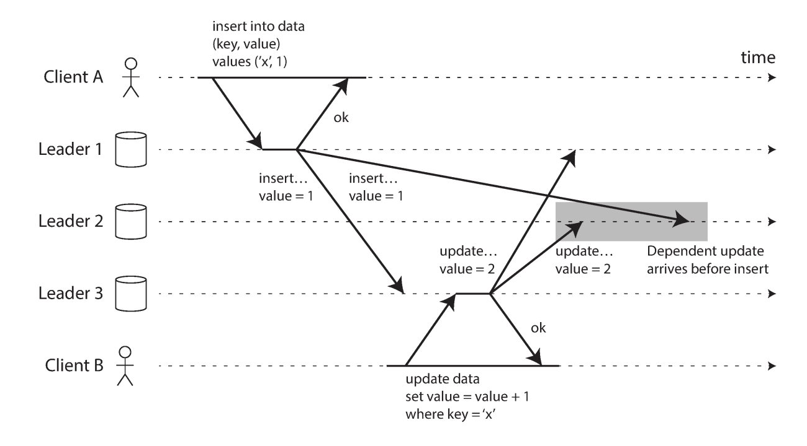

# Skipped Sections
2. Data Models and Query Languages
   - Query Languages for Data
   - Graph-Like Data Models
     - Graph Queries in SQL
     - Triple-Stores and SPARQL
     - The Foundation: Datalog
3. Storage and Retrieval
   - Transaction Processing or Analytics?
   - Column-Oriented Storage 
4. Encoding and Evolution
5. Replication
   - Leaderless Replication 
     - Limitations of Quorum Consistency 
     - Sloppy Quorums and Hinted Handoff
     - Detecting Concurrent Writes
6. Transaction 
   - Serializability
7. Consistency and Consensus
   - Ordering Guarantees

# Part I. Foundations of Data Systems
## 1. Reliable, Scalable, and Maintainable Applications
*Data-intensive*, on the contrary of compute-intensive, application is mainly 
responsible for:
- store data (database)
- remember result of expensive operations (cache)
- allow users to search data by keywords and filter data (search indexes)
- send a message (async) to another process (stream processing)
- periodically crunch a large amount of accumulated data (batch processing)

### Metrics of Distributed Systems
#### Reliability
The system continue to work correctly even in the face of adversity.
- NOTE: A *fault* is defined as one component of the system deviating from its
  spec, where as *failure* is when the system as a whole stops providing the
  required service to the user.
- Faults can be classified to:
  - Hardware fault, e.g. hard disk crash, faulty RAM, blackout power grid,
    unplugged network cable.
  - Software fault, e.g. systematic error, software bug, running process
    running up shared resources.
  - Human errors.

#### Scalability
The system's ability to cope with increased load.
- *Load* can be describe in various way:
  - Request per second (web server)
  - Ratio of reads to writes (database)
  - The number of simultaneously active users in a chat room.
- *Performance* can be characterized by
  - Throughput: The number of records we can process per second.
  - Response time: The tie between a client sending a request and receiving
  the response.
    - NOTE: *Latency* characterizes the actual time of handling the request,
    which is measured at the backend, whereas response time normally counts
    the time spent for the entire request/response cycle.
- To cope with load, we can either:
  - *Scaling up*: Developing more powerful machines.
  - *Scaling down*: Distributing the load across multiple smaller machines.
  - There is no one-size-fits -all scalable architecture.
  - *Stateless service*: Each service is handled independent from the state of 
  local host.

#### Maintainability 
Fixing bugs, keeping its systems operational, investigating failures...

Design principles for software systems:
- *Operability*: Easy for teams to keep the system running smoothly.
- *Simplicity*: Easy for new engineers to understand the system.
- *Evolvability*: Easy for engineers to make change in the future.

## 2. Data Models and Query Languages
### Relational Model vs. Document Model
#### Relational Model
For instance, SQL, organizes data into *relations* (an unordered collection of 
tuples).
- Pros: 
    - Hides implementation detail behind a cleaner interface.
    - Generalizable, fits the diverse use cases.
- Cons: 
    - *Impedance mismatch*: Awkward translation layer is required between the
    objects in the application code and the database model of tables, rows,
    and columns. 

NoSQL
- Pros: Easy to achieve greater scalability, open source, can handle
  queries that are not well supported in relational model.
- Cons: Does not support ACID transactions across multiple document.

#### Document Model
- Data structure like a resume, a self-contained document.
- Normally stored as JSON and XML.
- Pros:
  - JSON has better *locality* than the multi-table schema used in relational
  model. While fetching data, we do not need to perform multiple queries
  or/and join subordinate tables.
  - We can explicitly write down a one-to-many relationships.
- Cons:
  - However, it is hard to perform *normalization* (the removal of
  duplication) where many-to-one relation is required. Particularly,
  `JOIN` operation in document model is slow.
  - Cannot directly refer to a nested item within a document.
- MongoDB, RethinkDB, CouchDB.

#### Graph-Like Data Model
A good way of expressing many-to-many relationships.

A graph consists of:
- *Vertices* V (aka. nodes, entities), consists of 
  - A unique identifier.
  - A set of outgoing edges.
  - A set of incoming edges.
  - A collection of properties (kv pairs).
- *Edges* E (aka. relationships, arcs), consists of
  - A unique identifier.
  - The vertex at which the edge starts (tail vertex).
  - The vertex at which the edge ends (head vertex).
  - A label to describe the kind of relationship between the two vertices.
  - A collection of properties (kv pairs).
- Normally used for storing 
  - Social graphs, V = people, E = which people know each other.
  - The web graph, V = web pages, E = HTML links to other pages.
  - Road or rail networks, V = junctions, E = rods or railway lines.

## 3. Storage and Retrieval 
*Index* is an additional structure, that is derived from the primary data, 
which develops an efficient way of key lookup.
- Tradeoff: well-chosen indexes speed up read queries, but every index slows 
down writes.

### Hash Indexes
Keep an in-memory hash map where every key is mapped to a byte offset in the 
data file.

#### Bitcask
A log-structured storage engine that
- Stores key in RAM, values on disk.
- Break the log into segments of a certain size by closing a segment file when 
  it reaches a certain size. Keys are mapped (using hash) to the file offset of 
  each segment file.
  - On key lookup, we check the most recent segment, and if not present, check 
  the second-recent and so on.
  - *File formate*: Binary, encodes each record with the length of string, then 
  followed by the row data
  - *Deleting records*: Overwrite a *tombstone*
  - *Crash recovery*: Restore each segment's hash map by reading the entire 
  segment file, noting the offset of the most recent value for every key.
    - A snapshot of each segment's hash map is stored to speed up this process.
  - *Partially written records*: add checksum.
  - *Concurrency control*: Enforcing only one writer thread.
- Perform *compaction*, the removal of duplicate key, in a background thread.
- Suited to the situation where the value of each key is updated frequently.

Limitations:
- Hash table must fit in memory.
- Range queries are not efficient. Cannot easily scan over all keys between 
  `kitty000` and `kitty999`.

### SSTables and LSM-Trees
LSM-tree has two parts: 
- *Memtable*: An in-memory table for storing write queries
- *SSTable*: Persistent data that flushed to disk. Each record is stored in 
  order of key.

On a writing query:
- The query is stored in memtable. When memtable reaches a pre-determined 
  threshold, it become immutable. Deletion is simply write a tombstone value.
- *Minor compaction*: Immutable memtables are flushed to disk and become 
  SSTable, all duplicate keys are merged.
- *Major compaction*: When SSTable is too large, it also merged with another 
  SSTable.

On merging two SSTable:
- Read input files side by side, and look at the first key in each file, copy 
  the key with smallest key to the result file.
- If two key are the same, copy the one from the most recent file.
- Fast on writing, but slow for seeking non-existing key (must iterate 
  through all segment and in memory map).

Key lookup:
- On read, first try to find in memtable, if absent, find on disk.
- Store a sparse key-indexing in memory. 
  - In terms of sparse, it means we don't need to record the indexing of all 
  keys, instead, we can skip several keys.
- On finding a key, for instance `handiwork`, look for the offset for keys 
  `handbag` and `handsome`, then jump to `handbag` and scan from there.

### B-Trees
Break the database down into fixed-size *blocks* or *pages*, 4KB each.
- One page is designated as the root of B-tree
- Each chile is responsible for a continuous range of keys.
- Leaf page stores each individual key, which either contains the value for each 
  key inline or contains references to the pages where the values can be found.
- *Branching factor* describes the number of references to child pages in one 
  page.
- Efficiency: n keys has O(log n) depth.

Key lookup: 
- Simply read from each page until reaches the leaf node.
- Similar for value update on existing key.

Insert
- When insert a non-existing key, 
  - Find the page whose rage encompasses the new key and add it to that page.
  - If there is no enough space for the page P, splits P into two half-full 
    pages to accommodate the new key.

If the program crashes in the middle of child split, index is corrupted, 
countermeasure like WAL (write-ahead log) is used.

And to perform concurrency control, *latches* (lightweight locks) is used.

### Tradeoff 
Pros:
- LSM-tree is faster for writes, B-tree is faster for reads.
- B-tree need must write every piece of data at least twice: WAL, tree page, and 
  sometime even the third time for split child.
- LSM-tree has high write throughput, partially because they have lower write 
  amplification, and partially because they sequentially write compact SSTable 
  files rather than having to overwrite several pages in the tree.
- LSP-tree can be compressed better, the splitted node of B-tree potentially 
  leads to fragmentation on disk.

$$\text{write amplification} 
= \frac{\text{data written to the storage device}}{\text{data written to the database}}$$

Cons:
- Compaction process can sometime lag the ongoing rw.
- Compaction preempts the bottleneck on disk write bandwidth with rw.
- Hard for managing transaction.

### OLAP and OLTP
- OLTP (Online Transaction Processing) are the system that user-facing, 
  typically looks up a small number of records by some key, insert or update the 
  database, the access pattern is usually interactive.
- OLAP (Online Analytic Processing) are queries that scan over hug number of 
  records but only read a few column, perform calculation like summation.

## 4. Encoding and Evolution
### JSON and XML
### Protocol Buffers
Key component consists of:
- A *schema* for any data that is encoded (possibly a IDL, interface definition 
  language)
- A *code generation tool* that takes a schema definition and produces classes 
  that implement the schema in various programming languages.
- *Field tags*, are those number that appear in the schema definition.
  - A field is omitted from the encoded record if its field tag is not set.
  - Forward compatibility: When old code tries to read data written by new code,
    un-recognized field tags are ignored.
  - Backward compatibility: As long as each field has a unique tag number, new 
    code can always read old data.

# Part II. Distributed Data
## 5. Replication
### Readers and Followers
A *replica* is a copy of the database stored in each node.

Leader-based replication (aka. active/passive or master-slave replication)
- One of the replica is chosen to be *leader*. When clients' initiate write 
  requests, the request must be send to leader and first writes the new data to
  its local storage.
- The other replicas are *followers*. When leader writes new data to its local 
  storage, it send data change to all of its followers as part of a
  *replication log*. Each follower update their local storage according to this 
  log.
- For read requests, client can query either the leader or followers; where as 
  writes must query leader.

#### Synchronous vs. Asynchronous Replication

- Follower 1 is *synchronous*, the leader waits until follower 1's ok.
- Follower 2 is *asynchronous*, the leader sends the message but does not wait 
  for its response.
- We can also make one follower sync and the others async. If the sync follower 
  is unavailable or slow, one async is make sync. This configuration is called
  *semi-sync*.

#### Setting up New Followers
1. Take a consistent snapshot of the leader's database at some point in time.
2. Copy the snapshot to the new follower node.
3. The follower connects to the leader and requests all the data changes that 
   have happened since the snapshot was taken. Assume the snapshot is associated
   with an exact position in the leader's replication log.
4. When the follower has processed the backlog of data changes since the 
   snapshot, we say it has *caught up*. After this stage, the newly set-up-node
   can process data changes from the leader as they happen.

#### Handling Node Outages
Follower failure: Catch-up recovery
- Use log to determine the latest transaction before failure occurred, then sync
  with the leader for all subsequent updates.

Leader failure: *Failover*
- Promotes a follower to leader, configs clients so they sent write requests to 
  the new leader.
- The promotion process can either happened manually, or automatically, in which
  - Determining that the leader has failed. (Sometime just use time out)
  - Choosing a new leader. The best candidate is usually the one with the most 
    up-to-date data.
  - Reconfiguring the system to use the new leader.

Problems with failover:
- What if new leader have not received all the writes from the old leader 
  before it failed? 
  - Solution: Discard unreplicated writes from old leader
- *Split brain*: two nodes both believe they are the leader.
  - Solution: Shutdown one of those if detected.
- How to determine timeout?

#### Implementation of Replication Logs
Statement-based replication
- Leader logs every write request (statement) that it executes and sends that 
  statement log to its followers.
- But if the statement calls a nondeterministic function (`NOW()` for instance),
  used an auto-incrementing column, or has side effects, then it fails.

Write-ahead log (WAL) shipping
- Log formed in B-tree or SSTable can be used to build the replica on another 
  node.
- Buf this make replication closely coupled to the storage engine: if the 
  database changes its storage formate from one version to another, it is 
  typically not possible to run different versions of the database.

Logical (row-based) log replication
- A logical log for a relational database is a sequence of records describing 
  writes to database tables at the granularity of a row.
  - On insertion, log contains new values of all columns
  - On deletion, log contains information to identify the row deleted (e.g.
    primary key).
  - For updating, log contains information to identify the row to be updated, 
    and the new values of all columns.

### Problems with Replication Lag
In single-leader replication *replication lag* is referring to the delay 
between a write happening on the leader and being reflected on a follower.

#### Reading Your Own Writes
*Read-after-write consistency* is a guarantee that if the user reloads the page, 
they will always see any updates they submitted themselves.

Methods of implementation:
- Read modifiable data from the leader.
- But if most of the data is modifiable, then we need to add another criteria 
  on determine whether read from the leader or follower. For instance, we can 
  use timestamp to determine: for one minute after last update, read from 
  leader.

#### Monotonic Reads

To prevent this issue, we can make sure each user always makes their reads from 
the same replica.

#### Consistent Prefix Read
Suppose a third party, namely *Observer*, is monitoring the conversation between 
*Mr. Poons* and *Mrs. Cake*, Observer may see the answer before the question 
if some replica is slower than others.

*Consistent prefix read* guarantees a sequence of writes happens in a certain 
order, then anyone reading those writes will see them appear in the same order.

### Multi-Leader Replication
Pitfall of leader-based replication: all writes must go though the leader. So 
if one cannot connect to the leader (network cutoff for instance) write is 
prohibited.

Trade-off between single- and multi-leader configurations:
- *Performance*: Single-leader config potentially has large latency as the 
  leader may distant from the client.
- *Tolerance of datacenter outages*: Single-leader config is a single point of 
  failure.
- *Tolerance of network problems*: Single-leader config is sensitive to network 
  condition as writes are made synchronously over the inter-datacenter link.

#### Handling Write Conflicts
Most of the multi-leader replication handle  write conflict poorly, so the best 
implementation is to *avoid conflicts*, rather than resolve.

Database must resolve the conflict in a *convergent* way, so all the replica 
arrive at the same final value when all changes have been replicated.
- Given each write a unique ID, pick the write with the highest ID as the 
  *winner*.
- Given each replica a unique ID, and let writes that originated at a 
  higher-numbered replica always take precedence.

#### Multi-Leader Replication Topology

In circular and star topology, to prevent infinite replication loop, each node
is given a unique identifier, and in the replication log, each write is tagged 
with the identifiers of all the nodes it has passed through.

Issue with multi-leader replication:
- In star and circular topology, if just one node fails, it can interrupt the 
  flow of replication messages between other nodes.
- In all-to-all topology, it is possible that some replication messages may 
  "overtake" others, due to the lag of network for instance. One possible 
  solution is *version vectors*, will be discussed later.

### Leaderless Replication
Client send read and write query to several nodes in parallel.

How does an unavailable node catch up when it comes back?
- *Read repair*: When a client make a read from several nodes in parallel, it 
  can detect stale responses. Client can notice the stale value can write the 
  newer value back to that replica.
- *Anti-entropy process*: Use a background process that constantly looks for 
  differences in the data between replicas and copies any missing data from one 
  replica to another.

#### Quorums for reading and writing
A *quorum* is the minimum number of votes that a distributed transaction has to
obtain in order to be allowed to perform an operation in a distributed system.

If there are $n$ replicas, every write must be confirmed by $w$ nodes to be 
considered successful, and every read must query at least $r$ nodes for each 
read.
- If $w + r > n$, we call those rw *quorum reads and writes*.
- Commonly choose $w = r = (n+1)/2$.

## 6. Partition
- *Partition* are defined in such a way that each piece of data belongs to 
  exactly one partition.
- The goal of partitioning is to spread the data and query load evenly across 
  multiple machine, avoiding hot spots.
- Partition improves the scalability of a system as large dataset can be 
  distributed across many disks, and the query load can be distributed across
  many processors.
- A *skewed partition* is one partition has more data or queries than others.
- A partition with disproportionately high load is called a *hot spot*.

### Partitioning of Key-Value Data
#### Partition by Key Range
- Partition ranges are not necessarily be evenly distributed.
- Partition boundaries can either manually chosen by an administrator or 
  automatically set be database.
- We can keep keys within each partition in sorted order.
- The downside of key range partition is hot spot. 
  - If we use timestamp as a key, then all keys within the same day leads to a 
    hot spot. A solution is adding prefix for each timestamp.

#### Partition by Hash of Key
Hash function can evenly map keys to a random number. 
- The advantage of performing range queries is lost.

*Consistent hashing* is a technique used to distribute keys uniformly across a 
cluster of nodes. The goal is minimizing the number of keys that needed to be 
moved when nodes are added, removed from the cluster.

#### Skewed Workloads and Relieving Hot Spots
Although we can distribute key evenly by using hashing, the issue of hot spot 
still remains in the case of all queries are rw to the same key, for instance,
celebrities.

### Partitioning and Secondary Indexes
A secondary index is often used to searching for occurrences of a particular 
value: find all action of user `123`, find all articles containing the word 
`apple`.

#### Partitioning Secondary Indexes by Document
Each partition maintains its own secondary indexes, covering only the documents 
in that partition. This is called *local index*.  Database automatically tag 
each item. For instance, whenever a car is added to the database, adds it to 
the list of document IDs for the index entry `color:red`. 
- But because there is no guarantee for having the item with same tag in the 
  same partition, so query needs to be sent to all partitions. This querying 
  approach is called *scatter/gather*, which prone to tail latency 
  amplification.

#### Partitioning Secondary Indexes by Term
Construct a *global index* that covers data in all partitions.
- Global index must also be partitioned, for instance, colors starting with the 
  letter `a` to `r` appears in partition 0, `s` to `z` appears in partition 1.
- This is kind of index is called *term-partitioned*.
- Faster reads as only need to request to the partition containing the term that 
  it wants. 
- Slower writes as single write request may affect multiple partitions of the 
  index.

### Rebalancing Partitions
*Rebalancing* refers to the process of moving load from one node to another in 
the cluster.
#### Strategies for Rebalancing 
Do not use the *hash mod N* strategy for rebalancing, where N is the number of 
nodes.
- Issue with this strategy is that when the number of node changes frequently,
  rebalancing also happens frequently.

Fixed number of partitions:
- In this configuration, the number of partition is usually fixed when the 
  database is first set up and not changed afterward.
- If a node is added to the cluster, the new node can steal a few partitions 
  from every existing node until partitions are fairly distributed once again.

Dynamic partitioning:
- Split a partition into two that approximately half of the data ends up on each 
  side of the split if a partition grows to exceed a configured size
- Conversely a partition merge with an adjacent partition if it shrink below 
  some threshold.
- Pros: Number of partition adapts to volume.
- Cons: There is only one partition at the beginning, so all writes are 
  processed by one node and keeping others idle. Cannot balance the load.

Partitioning proportionally to nodes
- When a new node joins the cluster, it randomly chooses a fixed number of 
  existing partitions to split, and then takes ownership of one half of each of 
  those split partition while leaving the other half of each partition in place.

### Request Routing
*Service discovery*: When data is partitioned across different nodes, question
arises as how does the client knows which node to connect to while make request?
The solution is diverse:
- *Gossip protocol*: Requests can be sent to any node, and that node forwards 
  them to the appropriate node for the requested partition.
- Send all requests from clients to a routing tier first, which determines the 
  node that should handle each request and forwards it accordingly.
- Require that client be aware of the partitioning and the assignment of 
  partitions to nodes.

## 7. Transaction
Transaction is a way for an application to group several reads and writes 
together into a logical unit. Either transaction succeeds (*commit*), or it 
fails (*abort, rollback*).

### Concept of a Transaction
#### The Meaning of ACID
ACID principles are the safety guarantees that transaction provides, it 
includes:
- *Atomicity*: If a client wants to make several writes, but a fault occurs 
  after some of the writes have been processed, the transaction is aborted and 
  the database must discard or undo any writes it has made so far in the 
  transaction.
- *Consistency*: Having certain statements about your data (*invariants*) that 
  must always be true.
  - Consistency is a property of the application, for instance, it can be 
    described as in an accounting system, credits and debits across all account
    must always be balanced.
- *Isolation*: Concurrent executing transactions are isolated from each other.
- *Durability*: Once a transaction has been committed successfully, any data it 
  has written will not be forgotten, even if there is a hardware fault or the 
  database crashes.

### Weak Isolation Levels
Serializable isolation has a performance cost, so the constraint is loosed to
weaker isolation levels which protect against some concurrency issue, but not 
all. 

Later, we are going to introduce read committed and snapshot isolation level, 
where a read-only transaction is performed while concurrent write queries are 
ongoing.

#### Read Committed
Read committed makes two guarantees:
1. When reading from the database, you will only see data that has been 
  committed (no dirty read).
2. When writing to the database, you will only overwrite data that has been 
  committed (no dirty write).

No dirty read:

No dirty write:

Databases prevent dirty write by using row-level locks: when a transaction 
wants to modify a particular object, it must first acquire a lock and holds it 
until transaction is committed or aborted.

Databases prevent dirty read by remembering both the old committed value and the 
new value set by the transaction that currently holds the write lock.

Anomaly appears as following:

This issue is known as *read skew*. It is acceptable for online banking website
scenario as user can refresh the webpage to avoid, but in the case like backups
and analytic queries and integrity checks, it is unacceptable.

#### Snapshot Isolation and Repeatable Read
*Snapshot isolation* is a transaction sees all the data that was committed in 
the database at the start of the transaction.

To implement snapshot isolation, write locks are used to prevent dirty writes, 
but reads do not require any locks. Moreover, the database potentially requires 
to preform *Multi-version concurrency control (MVCC)*, where it maintains 
multiple versions of an object side by side.

Transaction IDs are used to decide which objects it can see and which are 
invisible. It works as follows:
1. At the start of each transaction, the database makes a list of all the other 
   transactions that are in progress at that time. Any writes that those 
   transactions have made are ignored, even if the transactions subsequently 
   commit.
2. Any writes made by aborted transactions are ignored.
3. Any writes made by transactions with a later transaction ID are ignored, 
   regardless of whether those transactions have committed.
4. All other writes are visible to the application's queries.

#### Preventing Lost Updates

Lost update can be prevented by using atomic write operations, explicit locking,
and compare-and-set.

#### Write Skew and Phantoms
*Write skew* can occur if two transactions read the same objects, and then 
update some of those objects. Write skew is often triggered when:
1. A `SELECT` query checks whether some requirement is satisfied by searching 
   for rows that match some search condition.
2. Depending on the result of the first query, the application code decides how
   to continue.
3. If the application decides to go ahead, it makes a write to the database and 
   commits the transaction.

*Phantom* is a write in one transaction changes the result of a search query in 
another transaction.

## 8. Consistency and Consensus
*Consensus*: Getting all of the nodes to agree on something.

*Eventual consistency (convergence)*: If one stop writing to the database and 
wait for some unspecified length of time, then eventually all read requests 
will return the same value.

### Linearizability
Make a system appear as if there were only one copy of the data, and all 
operations on it are atomic.

As the figure illustrates, all the operations excepts the last `read` perform 
by client B are considered as linearizable. The last is not linearizable 
because the `cas(x, 2, 4)` of client C operations already sets the value of 
register `x` to 4, but the result of client B's read is 2.

The CAP theorem
- If your application *requires* linearizability, and some replicas are 
  disconnected from the other replicas due to a network problem, then some 
  replicas cannot process requests while they are  disconnected: they must
  either wait until the network problem error is fixed, or return an error.
  (Consistent but not available )
- If your application *does not require* linearizability, then it can be written 
  in a way that each replica can process requests independently, even if it is 
  disconnected from disconnected from other replicas. (Available but not 
  consistent)

### Distributed Transactions and Consensus
#### Atomic Commit and Two-Phase Commit (2PC)
In single-node database, the transaction atomicity is determined by the commit 
record: 
- If present, then transaction is succeed (can be recovered from WAL if 
  process crashed).
- Otherwise rollback. 

Whereas in multi-object transaction, sending a commit request to all of the 
nodes is not enough. It could easily happens that the commit succeeds on some 
nodes and fails on other nodes, which violates the atomicity guarantees.

Two-phase commit (2PC) begins with the application reading and writing data on 
multiple database nodes (aka *participants, cohort*) in the transaction. When 
the application is ready to commit, the *coordinator*
1. Commit-request phase: Sending *prepare* request to each node, 
   asking if they are able to commit.
2. Commit phase: 
   - If all participants reply "yes", the coordinator sends out a *commit*
     request in phase 2. 
   - Otherwise if any participant replies "no", the coordinator sends out an 
     *abort* request to all nodes in phase 2.

However, if both a coordinator and participant is failed during the commit 
phase, it is possible for the cluster ends up being an inconsistent state: the 
failed participant may have already committed after receiving the request, 
however, for the participants have to received the request, they have to wait 
until the coordinator reconnect or be elected.

Three-phase commit (3PC) is more fault-resilient by introducing an additional 
phase, and we are assuming the network delay is bounded, and we can detect 
whether a node is failed:
1. Can-Commit Phase: The coordinator sends a Can-Commit message, asking each 
   participant if they are ready to commit.
2. Pre-Commit Phase: If all participant respond Yes, the coordinator broadcasts
   a Pre-Commit message. Participants acknowledge the message and prepare to 
   commit transaction.
3. Do-Commit: Once the coordinator receives all acknowledgements, it sends a 
   Do-Commit message, instructing participants to finalize the transaction.

Remark:
- If any of participants crashes during 2PC
  - If any of the prepare requests fail or time out, the coordinator abort the 
    transaction.
  - If any of the commit or abort requests fail, the coordinator reties 
    indefinitely.
- If coordinate crashes during 2PC
  - If crashes before the prepare request, abort.
  - If crashes after the prepare request, wait to hear back from the 
    coordinator. A participant's transaction in this stat is called *in doubt*
    or *uncertain*.
- 2PC is called a *blocking* atomic protocol since it can become stuck for the 
  coordinator to recover.
- 3PC is *non-blocking* but it assumes a network with bounded delay and nodes 
  with bounded response time.
- In general, non-blocking atomic commit requires a *perfect failure detector*,
  a reliable mechanism for telling whether a node has crashed or not, which is 
  impossible for network with unbounded delay. And this is why 2PC is still 
  used.
 
#### Fault-Tolerant Consensus
A consensus algorithm must satisfy the following properties:
- *Uniform agreement*: no two nodes decide differently.
- *Integrity*: No node decides twice.
- *Validity*: If a node decides value $v$, then $v$ was proposed by some node.
- *Termination*: Every node that does not crash eventually decides some value.

Every time the current leader is thought to be dead, a vote is started to elect
a new leader:
- The election is given an *epoch number*. If there were conflict between two 
  different leaders in two different election, the leader with higher epoch 
  number prevails.
- Before the leader is allowed to decide anything, it must collect votes from a
  *quorum* of nodes. For every decision that a leader wants to make, it must 
  send the proposed value to the other nodes and wait for a quorum of nodes to 
  respond in favor of the proposal.
- If a vote on a proposal succeeds, at least one of the nodes that voted for it 
  must have also participated in the most recent leader election.

The limitation of consensus algorithms is they generally rely on timeouts to 
detect failed nodes, But in environment with high variable network delay, it 
often falsely believe the leader is failed dur to a transient network issue.

Moreover, there are edge cases with Raft when there are one particular network 
like that is consistently unreliable. Raft can get into situation where 
leadership continually bounces between two nodes, so system never make progress.