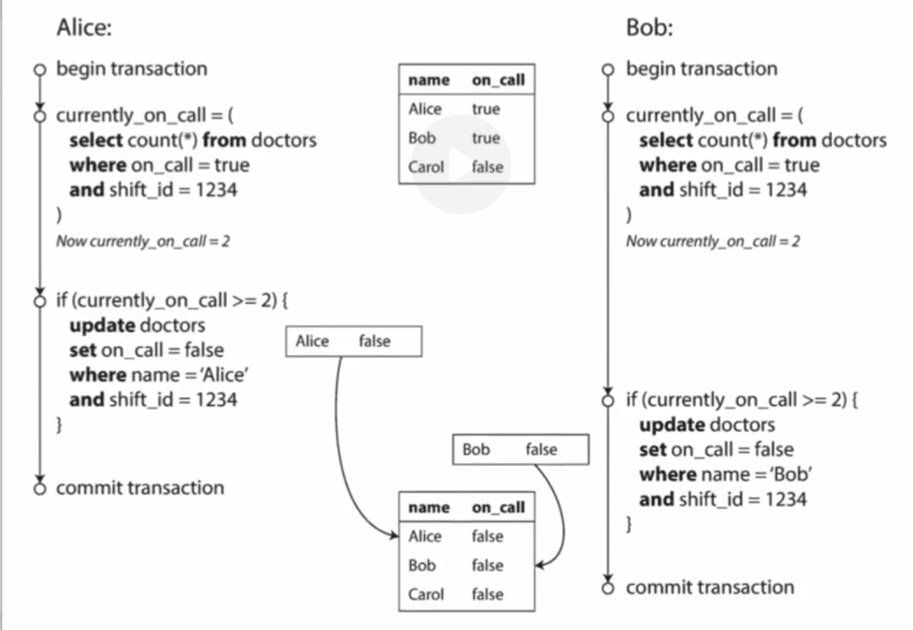

# Transaction Basics
## ACID Principle
A transaction in database design requires to satisfy ACID principles:
- Atomicity: Each transaction is treated as a single "unit".
- Consistency: A transaction can only bring the database from one consistent
state to another, preserving database invariants: any data written to the
database must be valid according to all defined rules.
- Isolation: concurrent execution of transactions leaves the database in the
same state that would have been obtained if the transactions were executed
sequentially.
- Durability: once a transaction has been committed, it will remain committed
even in the case of a system failure.

## How to Provide Assurance for ACID
### Atomicity
*Write Ahead Log (WAL)*:
- In MySQL, an
[undo log](https://dev.mysql.com/doc/refman/8.0/en/innodb-undo-logs.html)
is used to record information about how to undo the latest change by a
transaction to a clustered index record. When the transaction is unsuccessful,
undo log is used to roll data file back to the state that before transaction
begins.

### Concurrency
#### 2PL (Two-phase Locking)
A pessimistic concurrency control method that guarantees 
conflict-serializability. By the 2PL protocol, locks are applied and removed 
in two phases:
1. *Expanding Phase*: locks are acquired and no locks are released.
2. *Shrinking Phase*: locks are released and no locks are acquired.

2PL protocol is applied to transaction by locking the modifying object, so 
the race condition is prevented as when incoming transaction T is about to 
update a modifying object, T either 
- wait for acquiring the lock, or 
- roll back to the original state to prevent dead lock.

#### MVCC (Multi-version Concurrency Control)
A non-locking concurrency control method to provide concurrent access to the
database. On modifying a data file, we append the database with a new version
that contains timestamps. Therefore, non-blocking transactions are guaranteed
as each one of them maintains their own version of transaction record.

#### SI (Snapshot Isolation)
MVCC provides an isolation level called *snapshot isolation (SI)*, which 
guarantees all reads made in a transaction will see a consistent snapshot of 
the database, and the transaction itself will successfully commit only if all 
the updates since that snapshot are compatible.

SI revolve the issue regarding dirty reads, non-repeatable reads, phantom 
reads. However, a new issue is induced, called *write skew*.

The database requires at least one person with `on_call` is true. Suppose Alice 
and Bob wants to take a vacation and requests to set `on_call` to false, 
- Since their `on_call` fields are non-overlapping, so SI provides two 
independent snapshot.
- After the modification, both of them successfully commit the transaction 
with in since the two transactions from Alice and Bob do not conflict.
- However, once both of their `on_call` is set to false, it violates the 
premiss of at least one person with `on_call` is true.

Based on this issue, a new solution is purposed, called *SSI (serializable 
snapshot isolation)*, which traces the read data and perform conflict check 
while committing.

#### SSI (Serializable Snapshot Isolation)
On writing,
- stored data to memory, record keys to a set (saved for conflict check).

On committing,
- Acquire a lock to prevent race condition.
- Conflict check: roll back to original state if the current key read by 
transaction has been modified by other transactions.
- Acquire the latest version of transcation.
- Encoding: append all the key of on-writing data with a the version number.
- Batchwisely write all the data into the database engine, ensure atomicity 
and durability.

On reading,
- Fetch the data from existing data set, return on success.
- Otherwise find the encoded key within the database engine.
- Saves all teh data record, for the convience during the conflict check 
happened at transaction.

### Isolation
#### Isolation Levels
There are 4 phenomena that are potentially have per transaction
- *Dirty Reads* (aka uncommitted dependency): Occurs when  a transaction
retrieves a row that has been updated by another transaction that is not yet
committed.
- *Non-repeatable Reads*: Occurs when a transaction retrieves a row twice and
that row is updated by another transaction that is committed in between.
- *Phantom Reads*: Occurs when a transaction retrieves a set of rows twice and
new rows are inserted into or removed from that set by another transaction that
is committed in between.

## Reference 
\[1\] [Michael J. Cahill, Uwe Röhm, and Alan D. Fekete. 2008. Serializable 
isolation for snapshot databases. In SIGMOD ’08: Proceedings of the 2008 ACM 
SIGMOD international conference on Management of data, pages 729–738, New 
York, NY, USA. ACM.](https://dl.acm.org/doi/10.1145/1376616.1376690)
