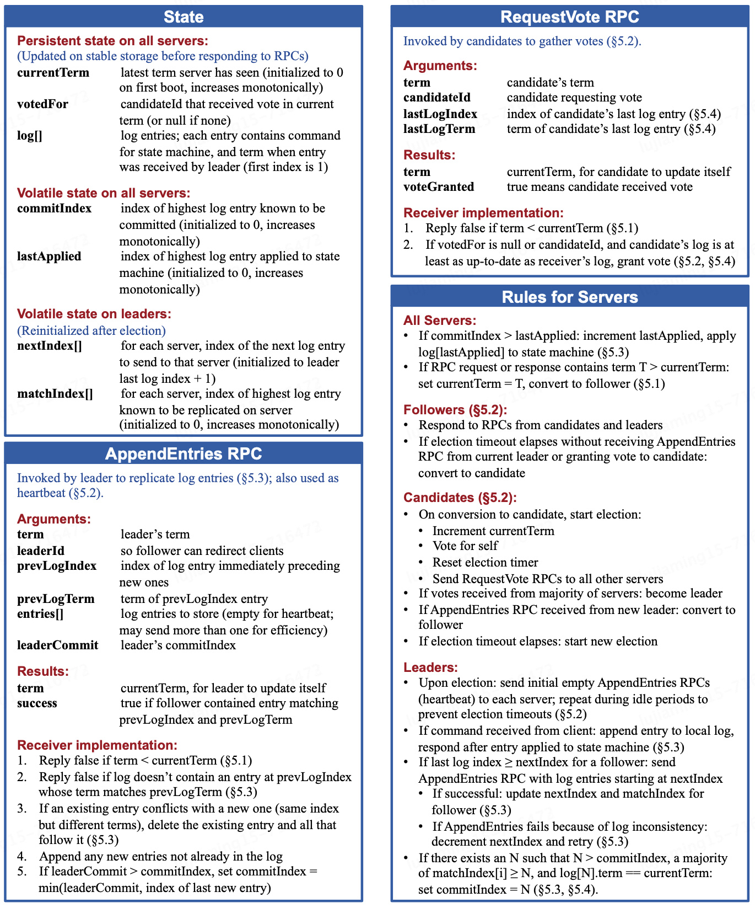
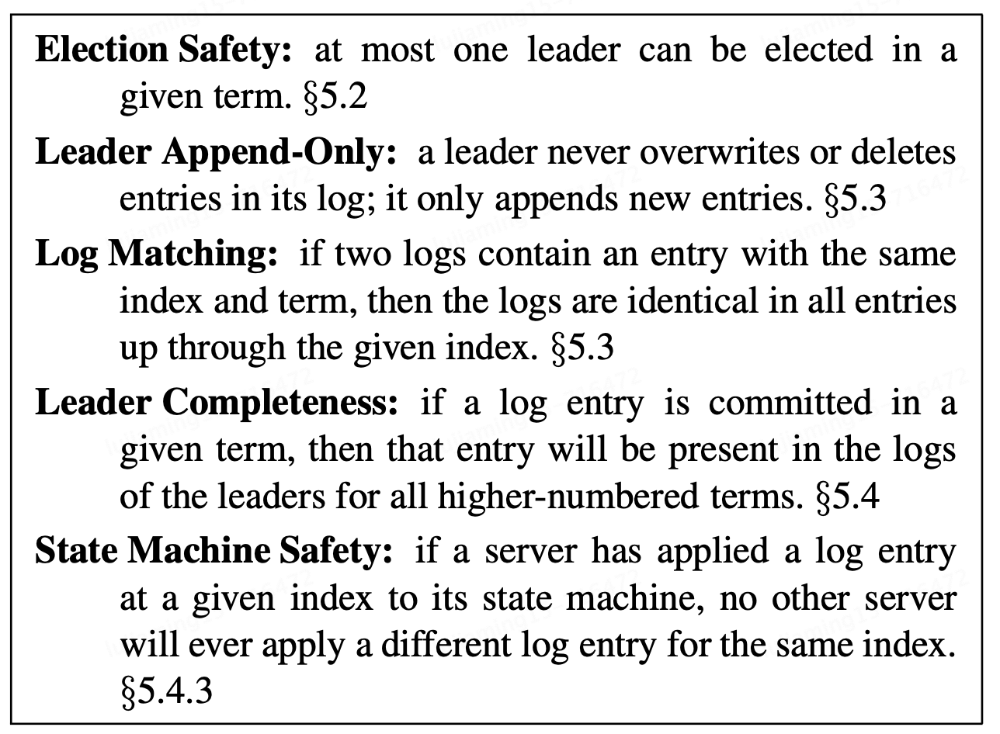
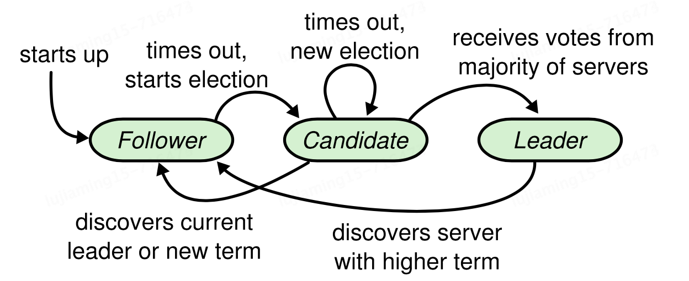
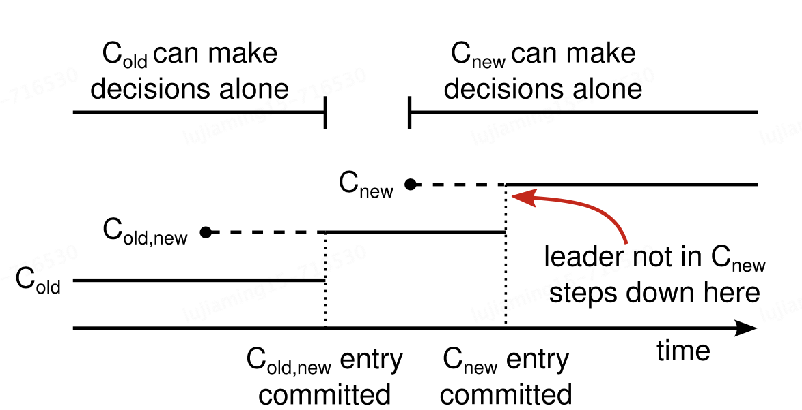

# Raft basics
Raft algorithm is summarized into the following:

## Introduction
Raft decomposes the consensus problem into three relatively independent subproblems:
- Leader election: A new leader must be chosen when an existing leader fails.
- Log replication: The leader must accept log entries from clients and replicate them across the cluster, forcing the other logs to agree with its own.
- Safety: The restriction we enforced on nodes to ensure correctness.

In Raft, each server is in one of three states at a given instance of time:
- *Leader*: Responsible for client command handling. 
- *Follower*: Passively accepts all requests sending from the leader.
- *Candidate*: Used to elect a new leader in the leader election stage.

Raft abstract time into the notion of *term*. Each term begins with an *election*, in which one or more candidates attempt to become leader. Each server stores a *current term* number that increases monotonically over time.

## Leader election

When servers are initially up, they begin as follower. Until they are timeout on not receiving leaders' heartbeat, they become a candidate and begins leader election, where:
- Increments its `currentTerm` and transitions to candidate.
- Votes for itself and issues `RequestVote` RPCs in parallel to each of the other servers in the cluster.
- Wait until:
  - Wins the election by receiving the majority votes.
  - Fails the election by receiving a `AppendEntries` RPC from other server.
  - Split the vote and restart the election when election timeout (randomly chosen from a fixed time interval, 120-300ms for instance).

## Log replication
The leader serves all the client's requests which each of them contains a command to be executed by the replicated state machines. The leader appends the command to its log as a new entry.

Log Matching Property:
- If two entries in different logs have the same index and term, then they stores the same command.
- If two entries in different logs have the same index and term, then the logs are identical in all preceding entries.

On sending a `AppendEntries` RPC: 
- `AppendEntries` will send the log entries along with `term` and `prevLogIndex` as an unique identifier for the log entries. Log Matching Property guarantees when we find a matching log entry with same `term` and `LogIndex`, all the preceding log has the same commands. 
- Leader maintains a `nextIndex` for each follower, which is the index of the next log entry will send to that follower.
- If a follower's log is inconsistent with the leader's, follower rejects the RPC, then leader will decrement `nextIndex` and retry.
- The inductive step will eventually reaches a point where leader and follower's log matches. When this happens, the succeed `AppendEntries` RPC will removes any conflicting entries in the follower's log and appends entries from the leaders's log.
  
## Safety
Election restriction:
- A candidate must contact a majority of the cluster to be election, so every committed entry must be present in at least one of those servers.
- A voter denies to vote if its own log is more up-to-date than that of the candidate.
  - Given to log entry $A$ and $B$, we say $A$ is more up-to-date than $B$ if $(term_A > term_B) ~||~ ((term_A == term_B) ~\&\&~ (logIndex_A > logIndex_B))$.

Log commitment restriction:
- For a leader decides to commit a log entry, that is, execute the command on on that log entry on leader's state machine, it must guarantee:
  - the log entry is stored on most of the server
  - at least one new entry from the leader's term must also be stored on majority of servers.

Entry RPC in Raft protocol contains `term` to detect stale leader:
- If the sender's term is older
  - RPC is rejected by the receiver, and the receiver sends back its term number
  - Sender reverts to follower and updates it term.
- If the receiver's term is older
  - Receiver steps done to follower and updates its term, processes the RPC. 

# Client protocol
Client can send request to the leader and receives the response only when the command is logged, committed, and executed on the leader's state machine.
- If client does not know who is the leader, he can communicate with any of the server, and server will tell who's the leader.
- If leader crashes, a new leader will be elected and therefore client can redo the stuff we have introduced above.

# Cluster membership changes

Raft use two-phase protocol when cluster membership changing. When the leader receives a request to change the configuration from $C_{old}$ to $C_{new}$:
- It stores the configuration for joint consensus $C_{old, new}$ as a log entry and replicates that entry to the majority of both of old and new configuration using RPC. And in the joint consensus phase:
  - Log entries are replicated to all servers in both configuration.
  - Any server from all configuration may serve as leader.
  - Agreement (for elections and entry commitment) requires separate majority from both old and new configuration.
- Once $C_{old, new}$ has been committed, the leader create a log entry of $C_{new}$ entry at and commits it to a majority of $C_{new}$.
- Once a server receives the new configuration, use it immediately for all future decisions (no matter committed or not).

# Log compaction
When perform log compaction in Raft:
- The entire system state is written to a snapshot on stable storage, then the log up to that point is discarded.
- A small amount of metadata is included in the snapshot, which are used in `AppendEntries` RPC consistency check:
  - `lastIncludedIndex`: The index of the last entry in the log that the snapshot replaces.
  - `lastIncludedTerm`: The term of that entry.

The leader uses a new RPC called `InstallSnapshot` to send snapshots to followers that are too far behind:
- If follower receives a snapshot containing new information not already in the recipient's log, the follower discards its entire log.
- If the received snapshot describes a prefix of the follower's log, entries covered by the snapshot are deleted but entries following the snapshot are still valid.

# Possible optimization on Raft protocol
## Implementing linearizability semantics
### At-least-once semantics
_At-least-once semantics_ is one of the commonly arisen issue in stateful distributed systems:
- when client sends a request to the server, server executes the requests, and send the response back to the client. However, the response is corrupted due to unknown reason(s). Client re-sends the request. 
- duplicate commands can manifest in subtle ways that client can recover from.
### Implementation details
We can implement linearizable semantics in Raft: 
- Client assign an unique identifier to each command.
- Each server's state machine maintain a _session_ for each client.
- The session tracks the latest serial number processed for the client, along with associate response.
- If a server receives a command whose serial number has already been executed it is respond immediately without re-executing the request.
> _Linearizable Semantics_:each operation appears execute instantaneously, exactly once, at some point between its invocation and its response.
### Issues on the provided implementation
**Issue 1:** Session expiration
Because disk resource is limited, we cannot keep track of the session data forever, a timeout for session expiration is needed. 
- Option 1: Set a upper bound on number of sessions and perform an eviction based on LRU policy.
- Option 2: Use an agreement of based on a preset timeout duration. During inactive period, client sends a keep-alive request to the server, otherwise the session expires.

**Issue 2:** Client continuously operations when the session was expired.
Implements a `RegisterClient` RPC that allocates a new client session and returns the session id to the client.If the server receives a command with unregistered id, respond an error to the client.

## Pre-vote phase
On network partitioning, it is possible that we have two local network in which one of them consists of quorum number of nodes and another does not. 
- The region reaches quorum can properly elects a leader on every term.
- Whereas the region does not reach quorum will constantly split the vote and increases its term number. 
When the network resumes, because the servers did not reach quorum have a term number that is much larger than those coming from another partition, servers from the other partition will step down and starts a new round of election. This decreases availability. 

The introduction of pre-vote phase is used to prevent such issue. On timeout for not receiving leader heartbeat, the node enters pre-vote phase, in which:
- it asks other servers whether its log was up-to-date enough to get their vote. This is aka _pre-vote_ check.
- the node increments its `currentTerm` and enters a election only if the node receives quorum number of acknownledgement response.

## Check quorum 

