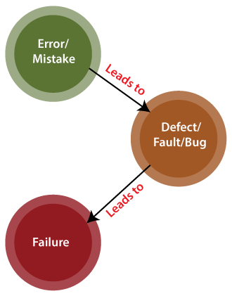

# How to Write a Good Documentation?
## Bug, Defect, Error, Fault and Failure
> "A person can make an error (mistake), which produces a defect (fault, bug)
> in the code, in software or a system, or a document. If the execution of the
> defect in code happens, the system will fail to do what it should do (or
> something it shouldn’t), which causes a failure." -- Thomas Muller.



Error/Mistake:
- Mistake lead by the **developer** when he/she misunderstood the requirement
or the requirement was not defined correctly.
```c 
/* @brief This function returns the sum of natural number within the array. */
int accumulate(const vector& vs)  {
  int acc = 0;
  for (const auto& v : vs) {
    acc += v;
  }
  return acc;
}

int main() {
  accumulate({1, 2, 3, -4}); // -4 is not a natural number.
}
```

Defect/Fault/Bug:
- An aberration from the actural and expected result of the **application or
software**.
- Found or trigger by QA(Quality Analyst).
```c 
int return_four(void) {
  return 3
}

TEST() {
  assert_eq(return_four(), 4);
}
```

Failure:
- An observable incorrect behaviour of the system.
```c 
int return_four(void) {
  return 3
}

int main() {
  std::cout << "The natural number Arabic numeral three is wrritten as: "
            << return_four() << std::endl;
}
```


